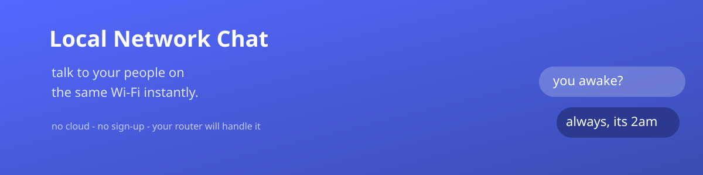

<p align="center">
  
</p>

<h1 align="center">Local Network Chat 💬</h1>

<p align="center">
  <b>talk to your people on the same Wi-Fi</b> — instantly.
  <br/>No cloud. No sign-up. Just you, me &amp; our router.
</p>

<p align="center">
  
  
  
</p>

---

Type a message → bam, it's on your friend's screen. Real-time, peer-to-peer on your own
network. Pick a name, open a browser, and it feels like the old days of chatting till 3am. 🌙

## ✨ What it does

- 🪪 Pick your name (**Naman** or **Pranav**) — or anyone, really.
- ⚡ Every message broadcasts to everyone connected, as it happens.
- 💾 Chat history lives on the server (`messages.json`) and reaches new joiners.
- 🔊 A little **ping!** when a new message lands.

## ▶️ Quick start

```bash
npm install
npm start        # server on port 3000 → http://localhost:3000
```

### Chat between two devices (same Wi-Fi) 🏠
1. Run the server on one machine.
2. Grab its **local IP**:
   - macOS/Linux → `ifconfig | grep inet` · Windows → `ipconfig`
3. Open `http://<that-IP>:3000` on the other device.
   - e.g. `http://192.168.1.50:3000`

Two names, one room, zero drama. 😄

### Different networks? 🌍
For friends across the internet, host the server somewhere (Render / Railway / a VPS)
and share that URL instead.

## 🗂️ The files

| File | Job |
|---|---|
| `server.js` | Express + Socket.IO server, holds chat history |
| `index.html` / `login.html` | pick a name |
| `home.html` | the cosy route to the chat |
| `chat.html` / `chat.js` / `chat.css` | the chat itself |
| `script.js` | older client kept around for reference |
| `notif.mp3` | the little ping 🔊 |

> Head's up: it's a friendly tool, not end-to-end encrypted — perfect for a trusted home
> network, don't put your bank passwords in there. 🙈

---

<p align="center">made for the people you'd text at 1am · rewā, india</p>